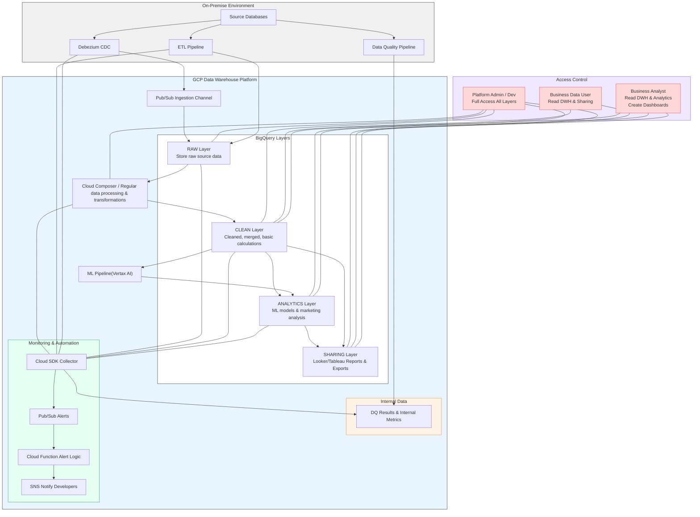
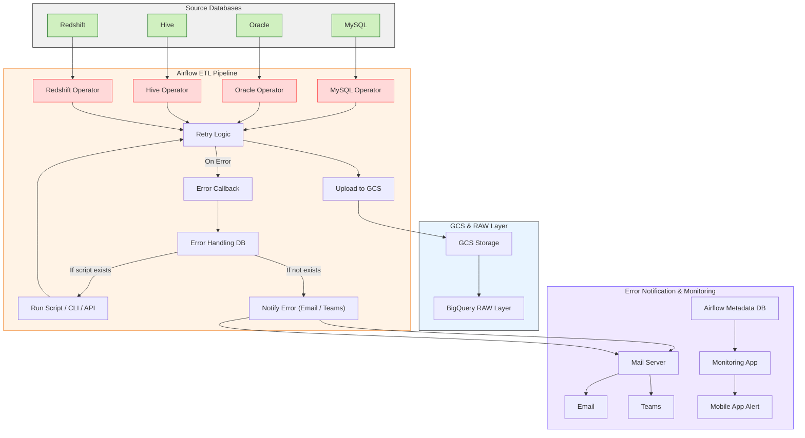
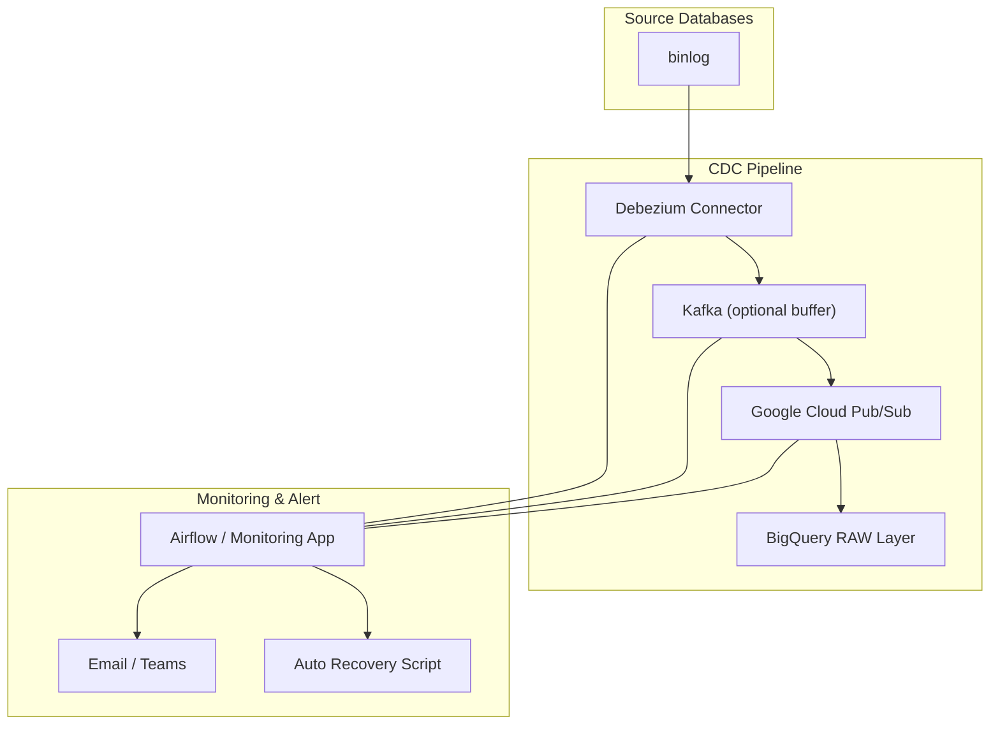
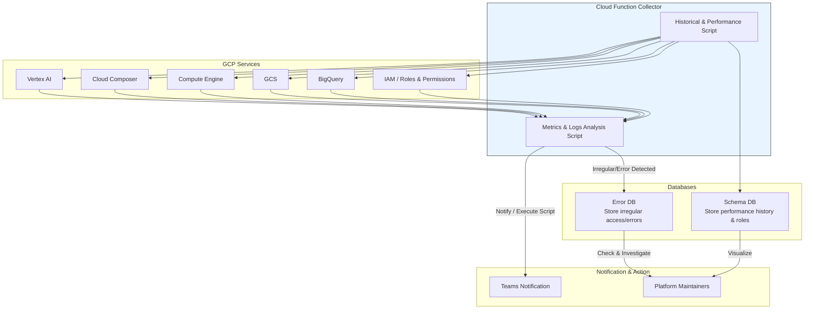

# GCP Data Warehouse & ML Pipeline Architecture

## アーキテクチャ概要
複数のオンプレミスデータソースを統合し、BigQueryを基盤としたクラウドDWHを設計・構築。
ETL／データクオリティパイプライン、機械学習パイプライン、アクセス制御、監視・自動化を統合した高度なデータプラットフォームアーキテクチャ。

## アーキテクチャー

## 技術スタック

* **クラウド**: GCP (BigQuery, Pub/Sub, Cloud Composer, Vertex AI, Cloud Functions, IAM)
* **ETL / DQ**: Airflow, Python
* **ML**: Vertex AI, scikit-learn, Pandas, NumPy, Statsmodels, Prophet
* **可視化**: Looker, Tableau
* **DB**: MySQL, Oracle, Hive, BigQuery, Redshift

## 技術的アピールポイント

1. **リアルタイム & バッチ統合**

   * Debezium + Pub/Sub + Composerによるハイブリッドデータ収集
2. **スケーラブルなクラウドDWH**

   * BigQueryの垂直レイヤー設計でデータ整形・分析・共有を分離
3. **自動化データパイプライン**

   * Cloud ComposerによるETL／DQ／定期更新の完全自動化
4. **機械学習統合**

   * Vertex AIによる分析レイヤー強化
5. **アクセス制御 & セキュリティ**

   * IAMロールによる詳細権限管理、データ暗号化
6. **統合監視 & アラート**

   * Cloud SDK + Pub/Sub + Cloud Functionsでジョブ失敗・不正アクセス・負荷を監視

## データ連携フロー
### バッチETLフロー

### リアルタイムデータ連携フロー

## 監視とエラー通知システム
### アーキテクチャー

こちらのシステムに対する**技術的なシステム概要とアピールポイント**を整理しました。Gitや技術資料に載せる形でまとめています。

---

### システム概要

本システムは、GCP上で稼働する**統合監視・アラート通知プラットフォーム**であり、複数のGCPサービスからメトリクスやログ、IAMロール情報を収集・分析し、異常検知や履歴分析、通知・自動対応を行います。

主な構成要素：

1. **データ収集対象サービス (GCP Services)**

   * IAM / Roles & Permissions
   * BigQuery
   * GCS
   * Compute Engine
   * Cloud Composer
   * Vertex AI

2. **Cloud Function Collector**

   * サービス上で稼働するサーバレス収集・分析エンジン
   * 2つの主要スクリプトで構成：

     * **Metrics & Logs Analysis Script**

       * メトリクス、ログからリアルタイムで異常アクセスやエラーを検知
       * Handler DB定義に基づき、自動スクリプト実行やTeams通知
       * 異常情報はError DBに格納
     * **Historical & Performance Script**

       * 過去のメトリクス・ログ・ユーザーアクション履歴を収集
       * IAMロール設定の集計
       * Schema DBに格納し、可視化やプラットフォーム保守者向け分析に利用

3. **データ保存 (Databases)**

   * **Error DB:** 異常アクセスやエラーを格納
   * **Schema DB:** サービスパフォーマンス履歴やユーザー行動・ロール情報を格納

4. **通知・アクション (Notification & Action)**

   * 異常検知時は**Teams通知**
   * プラットフォーム保守者がエラーDBやSchema DBを確認
   * 可視化ダッシュボードやレポートによる分析サポート

---

### 技術的アピールポイント

* **サーバレス設計によるスケーラビリティ**

  * Cloud Functionを利用したサーバレスアーキテクチャにより、収集対象増加時にも自動スケーリング可能。

* **リアルタイム異常検知と自動対応**

  * メトリクス/ログ分析スクリプトで異常アクセスやエラーを即時検知
  * Handler DBを参照し、自動スクリプト実行や通知による迅速な対応が可能

* **履歴データの集約と分析**

  * 過去メトリクスやユーザー行動履歴をSchema DBに集約
  * パフォーマンス分析、アクセス履歴監査、ロール管理可視化に対応

* **統合通知・可視化**

  * Teams通知に加え、プラットフォーム保守者向けダッシュボードに情報集約
  * エラーDBとSchema DBにデータを格納することで、分析と対応フローを分離

* **GCPサービス連携の柔軟性**

  * IAM、BigQuery、GCS、Compute Engine、Composer、Vertex AI など複数サービスの統合監視
  * 将来的な追加サービスにも容易に対応可能

* **運用効率向上**

  * 異常検知・自動スクリプト実行・通知を統合することで、人的対応工数を削減
  * システム全体の可視化と分析により、迅速な意思決定をサポート

---

