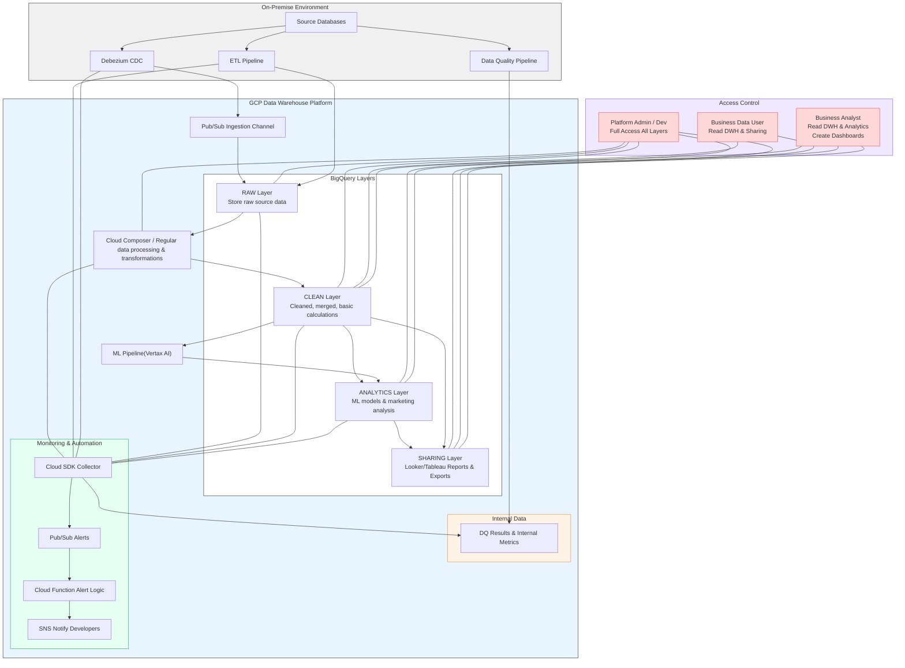

# GCP Data Warehouse & ML Pipeline Architecture

## アーキテクチャ概要
複数のオンプレミスデータソースを統合し、BigQueryを基盤としたクラウドDWHを設計・構築。
ETL／データクオリティパイプライン、機械学習パイプライン、アクセス制御、監視・自動化を統合した高度なデータプラットフォームアーキテクチャ。

## Mermaid 図

## 技術スタック

* **クラウド**: GCP (BigQuery, Pub/Sub, Cloud Composer, Vertex AI, Cloud Functions, IAM)
* **ETL / DQ**: Airflow, Python
* **ML**: Vertex AI, scikit-learn, Pandas, NumPy, Statsmodels, Prophet
* **可視化**: Looker, Tableau
* **DB**: MySQL, Oracle, Hive, BigQuery, Redshift

## 技術的アピールポイント

1. **リアルタイム & バッチ統合**

   * Debezium + Pub/Sub + Composerによるハイブリッドデータ収集
2. **スケーラブルなクラウドDWH**

   * BigQueryの垂直レイヤー設計でデータ整形・分析・共有を分離
3. **自動化データパイプライン**

   * Cloud ComposerによるETL／DQ／定期更新の完全自動化
4. **機械学習統合**

   * Vertex AIによる分析レイヤー強化
5. **アクセス制御 & セキュリティ**

   * IAMロールによる詳細権限管理、データ暗号化
6. **統合監視 & アラート**

   * Cloud SDK + Pub/Sub + Cloud Functionsでジョブ失敗・不正アクセス・負荷を監視
